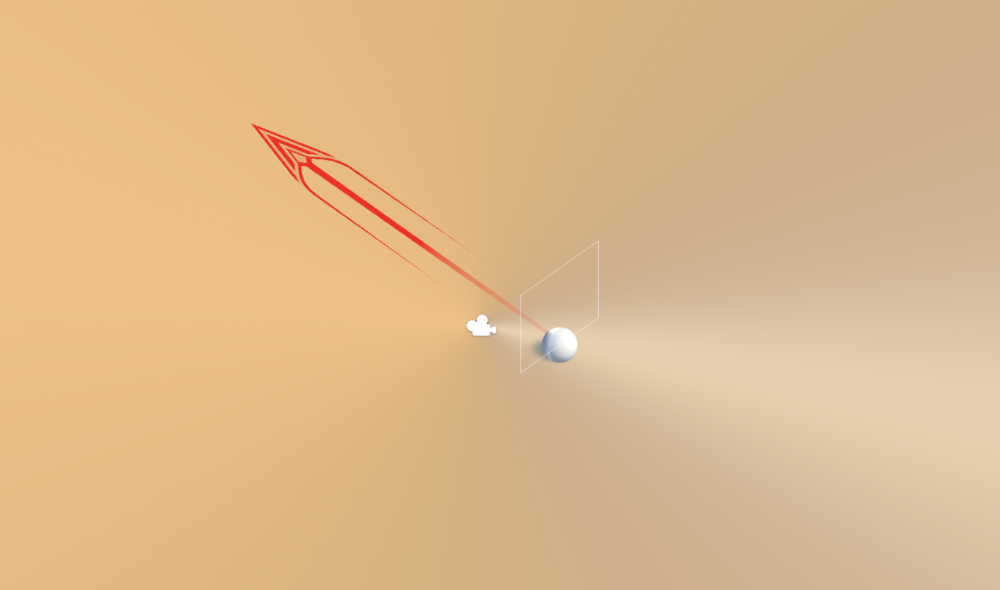

# LEAGUE OF LEGENDS SKILL SHOT TRAINER
(In development, only scripts uploaded)  

## Project Description
Game that mimics league of legends skill shots to train reaction time and accuracy. No enemies yet.
Although league of legends already has a training mode, the goal of this game was to a quick game to load up during loading between matches...I swear I dont take league of legneds that seriously.

### Built With
- Unity Version (Unity 2021.3.25f1)

## Gameplay
- movement using W,A,S,D as up, left, down, right
- attack with 'Q', with cooldown

## Still in development
- this (along with other games on github) were to test unity and coding in unity. I would love to continue on building a game when I have more time.

